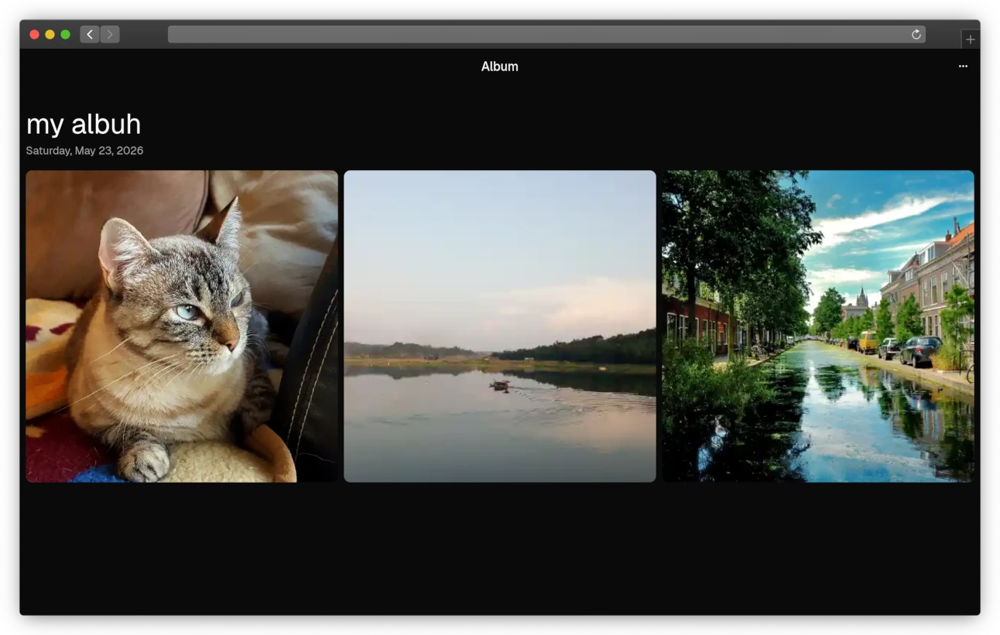

DCIM is a self-hostable photos app that runs on Cloudflare infra. Fork your own copy to host an instance. My instance is at [**dcim.aspiz.uk**](https://dcim.aspiz.uk)

DCIM is NOT encrypted at-rest, all photos and albums are publicly accessible if you know the UUID of them.
