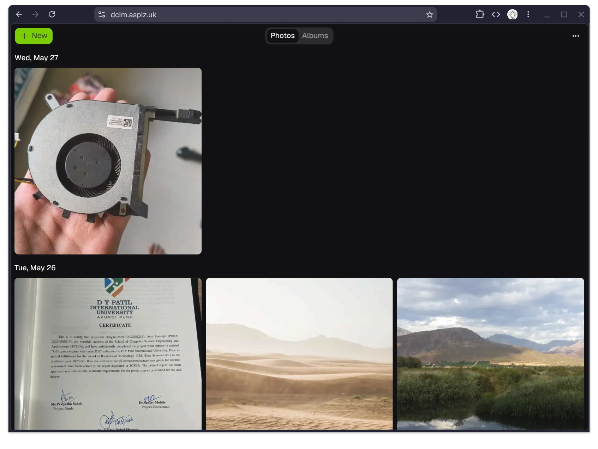
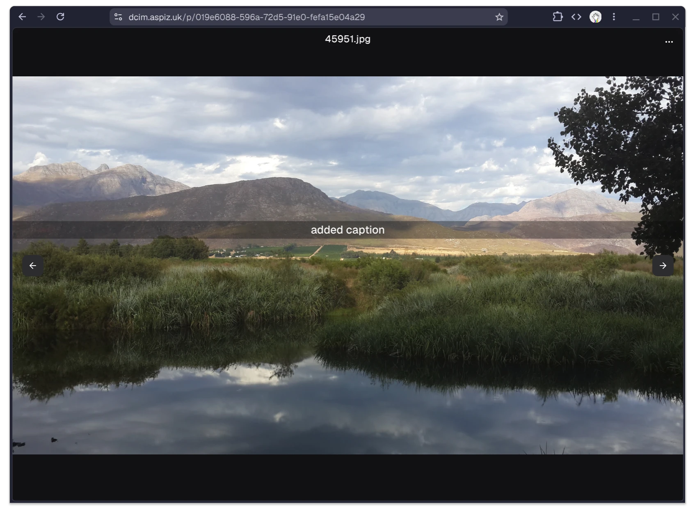
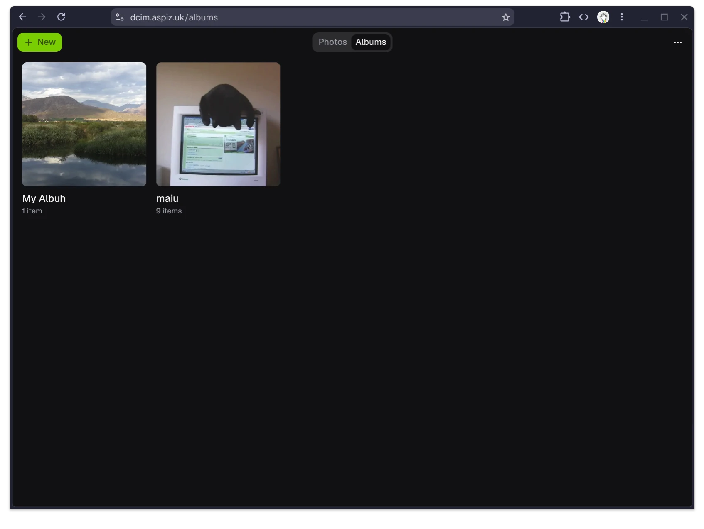
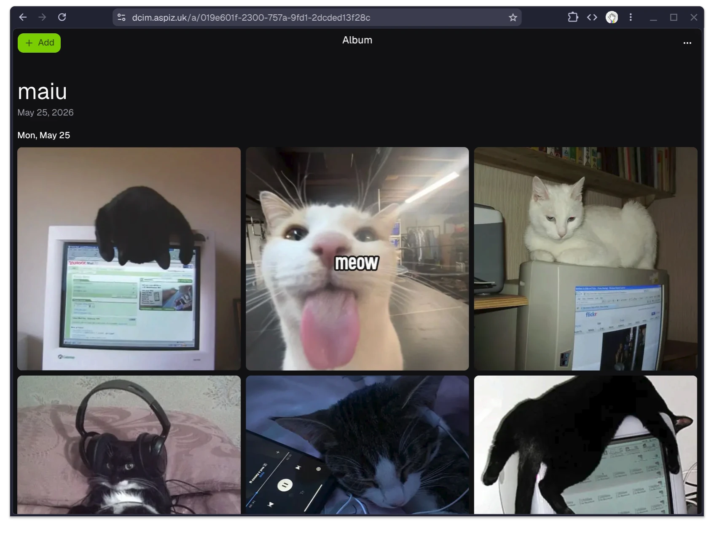

# dcim

Self-hostable photo sharing app running on Cloudflare infra.

dcim lets you upload photos from the browser, add captions, organize them into albums, and share them with a simple link. Albums and photos include Open Graph previews for embeds in chat apps and social media.

Photos are stored unencrypted and access is link-based. Anyone with a photo or album UUID can view it, so only share links with people you want to give access to.

Uploads can be compressed before storage to reduce space usage. Storage uses any S3-compatible backend, including self-hosted object storage and Cloudflare R2.

The API runs on Cloudflare Workers and metadata is stored in Cloudflare D1.

[Example album](https://dcim.aspiz.uk/a/019e601f-2300-757a-9fd1-2dcded13f28c)

