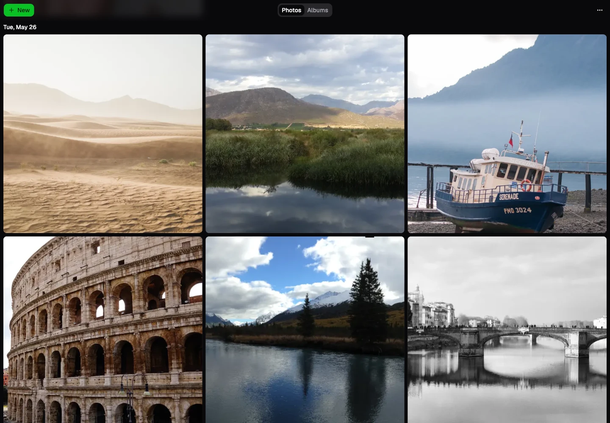
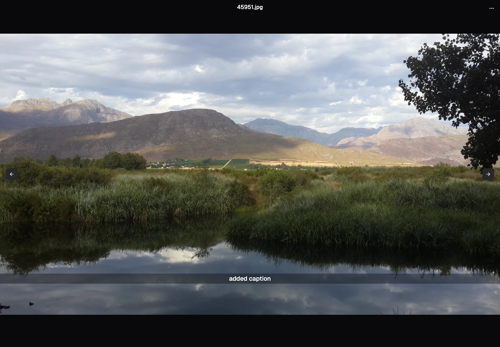
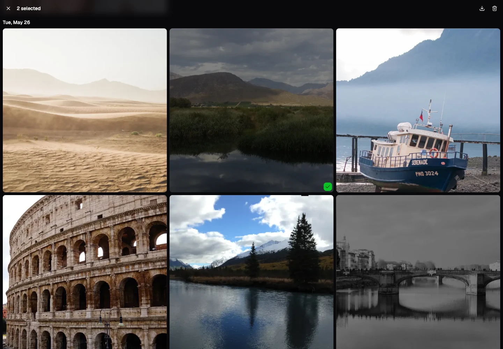
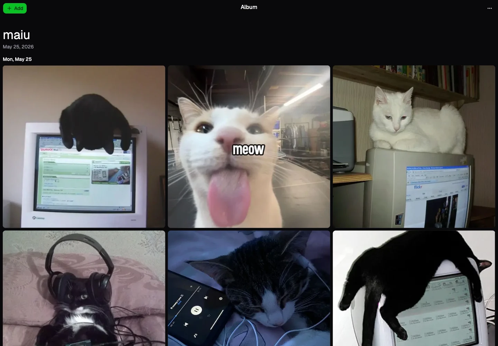

# dcim

Self-hosted photo sharing app. Easy to setup, runs on Cloudflare. [**Install**](./docs/install.md)

Upload photos to your dcim instance from a browser, add captions, organize into albums, and share them with a link, or even embed them on your website.

Albums and photos include Open Graph previews for embeds in chat apps and social media.

Photos are stored unencrypted and access is link-based. Anyone with a photo or album ID can view it, so only share links with people you want to give access to.

Uploads can be compressed before storage to reduce space usage. Storage uses any S3-compatible backend, including self-hosted object storage and Cloudflare R2.

The API runs on Cloudflare Workers and metadata is stored in Cloudflare D1.

[Example album](https://dcim.aspiz.uk/a/019e601f-2300-757a-9fd1-2dcded13f28c)

